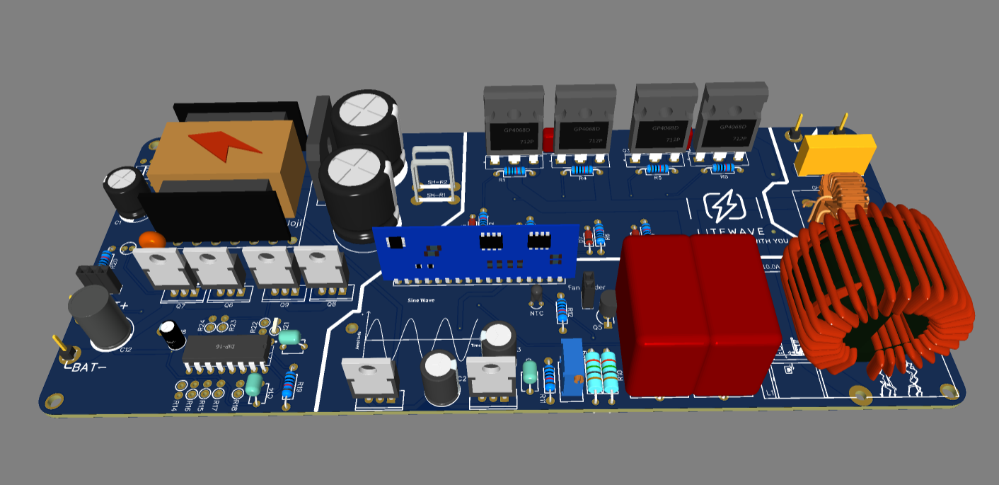

#PCB Details
Here's a well-structured README table for the provided data:

| **Parameter**               | **Details**                 |
|-----------------------------|-----------------------------|
| **PCB Size**                | 210mm x 90mm               |
| **Signal Layers**           | 2                           |
| **Non-Signal Layers**       | 10                          |
| **Total Components**        | 76                          |
| **Total Pads**              | 214                         |
| - Surface Pads              | 0                           |
| - Plated Through-hole Pads  | 214                         |
| - Non-Plated Through-hole Pads | 0                        |
| **Total Holes**             | 0                           |
| **Total Vias**              | 15                          |
| **Total Nets**              | 58/58                       |
| **Length of Tracks**        | 2779.94mm                   |
| **Copper Areas**            | 2                           |

# PCB Preview

## PCB Front

## PCB Back

## PCB 3D View 

## PCB 3D View 

